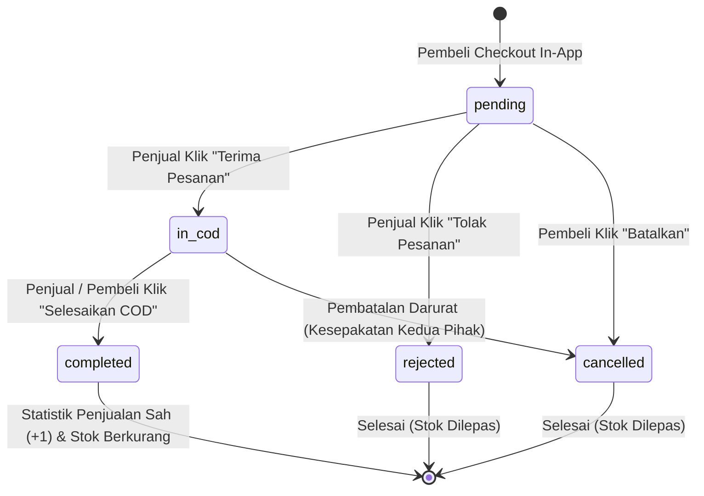

# 🗄️ SPESIFIKASI LENGKAP BACKEND & DATABASE: IN-APP ORDERS, SCHOOL MAP, & SALES STATS
## SNAPAN MARKET MOBILE PWA — SMKN 8 JAKARTA
> **Dokumentasi Teknis untuk Backend Workstation (Laptop B / Supabase Engineer)**  
> *Mencakup Skema Tabel PostgreSQL, Relasi Domain, Stored Functions, RLS Security Policies, Realtime Events, dan SQL Migrations.*

---

## 📌 DAFTAR ISI
1. [Overview Arsitektur Backend & Domain Model](#1-overview-arsitektur-backend--domain-model)
2. [Skema Entitas Database (PostgreSQL Tables)](#2-skema-entitas-database-postgresql-tables)
   - 2.1. [Tabel `orders` (Manajemen Pesanan In-App)](#21-tabel-orders-manajemen-pesanan-in-app)
   - 2.2. [Tabel `school_meeting_points` (Denah Hotspot SMKN 8)](#22-tabel-school_meeting_points-denah-hotspot-smkn-8)
   - 2.3. [Tabel `order_notifications` (Log Notifikasi Realtime)](#23-tabel-order_notifications-log-notifikasi-realtime)
   - 2.4. [Pembaruan Tabel `market_posts` & `profiles`](#24-pembaruan-tabel-market_posts--profiles)
3. [Alur State Machine & Siklus Hidup Pesanan (Order Lifecycle)](#3-alur-state-machine--siklus-hidup-pesanan-order-lifecycle)
4. [Logika Bisnis, Stored Procedures & Database Triggers](#4-logika-bisnis-stored-procedures--database-triggers)
   - 4.1. [Trigger Pengurangan Stok & Status Habis Otomatis](#41-trigger-pengurangan-stok--status-habis-otomatis)
   - 4.2. [Trigger Perhitungan Statistik Penjualan Sah](#42-trigger-perhitungan-statistik-penjualan-sah)
   - 4.3. [Proteksi Anti Double-Buy (Concurrency Safety)](#43-proteksi-anti-double-buy-concurrency-safety)
5. [Kebijakan Keamanan Row Level Security (RLS)](#5-kebijakan-keamanan-row-level-security-rls)
6. [Supabase Realtime Subscriptions (Push Event In-App)](#6-supabase-realtime-subscriptions-push-event-in-app)
7. [Script SQL Migrasi Lengkap (Ready-to-Run)](#7-script-sql-migrasi-lengkap-ready-to-run)

---

## 1. Overview Arsitektur Backend & Domain Model

Untuk menjawab komplain dari guru penilai mengenai **transaksi in-app** dan **keabsahan statistik penjualan**, Backend harus menyediakan sistem *Order Management Engine* yang mengikat secara sah antara Pembeli, Penjual, Produk, Titik Temu Sekolah, dan Status Verifikasi Transaksi.

```
┌─────────────────────────────────────────────────────────────────────────────┐
│                          ENTITY RELATIONSHIP DIAGRAM                        │
├─────────────────────────────────────────────────────────────────────────────┤
│                                                                             │
│  ┌─────────────────┐             1:N             ┌───────────────────────┐  │
│  │    PROFILES     │ ◄───────────────────────────┤        ORDERS         │  │
│  │ (Pembeli/Seller)│                             │ (In-App Transactions) │  │
│  └────────┬────────┘                             └───────────┬───────────┘  │
│           │                                                  │              │
│           │ 1:N                                              │ N:1          │
│           ▼                                                  ▼              │
│  ┌─────────────────┐             1:N             ┌───────────────────────┐  │
│  │  MARKET_POSTS   │ ◄───────────────────────────┤ SCHOOL_MEETING_POINTS │  │
│  │ (Produk Jualan) │                             │  (Denah Peta SMKN 8)  │  │
│  └─────────────────┘                             └───────────────────────┘  │
│                                                                             │
└─────────────────────────────────────────────────────────────────────────────┘
```

---

## 2. Skema Entitas Database (PostgreSQL Tables)

### 2.1. Tabel `orders` (Manajemen Pesanan In-App)
Tabel utama untuk mencatat setiap transaksi jual-beli antarsiswa.

```sql
CREATE TYPE order_status_enum AS ENUM (
  'pending',     -- Pembeli baru saja membuat pesanan (Menunggu respon penjual)
  'in_cod',      -- Penjual menerima pesanan (Sedang dalam proses janjian COD di sekolah)
  'completed',   -- Serah terima barang & pembayaran selesai di sekolah (Statistik SAH)
  'cancelled',   -- Dibatalkan oleh pembeli sebelum status in_cod
  'rejected'     -- Ditolak oleh penjual (misal: barang rusak / mendadak habis)
);

CREATE TABLE public.orders (
  id UUID PRIMARY KEY DEFAULT gen_random_uuid(),
  order_code VARCHAR(24) UNIQUE NOT NULL, -- Contoh: 'SNAPAN-ORD-849201'
  buyer_id UUID NOT NULL REFERENCES public.profiles(id) ON DELETE RESTRICT,
  seller_id UUID NOT NULL REFERENCES public.profiles(id) ON DELETE RESTRICT,
  post_id UUID NOT NULL REFERENCES public.market_posts(id) ON DELETE RESTRICT,
  
  -- Rincian Transaksi
  quantity INT NOT NULL DEFAULT 1 CHECK (quantity > 0),
  unit_price NUMERIC(12, 2) NOT NULL CHECK (unit_price >= 0),
  total_price NUMERIC(12, 2) NOT NULL CHECK (total_price >= 0),
  
  -- Titik Temu COD di Sekolah
  meeting_point_id VARCHAR(50) REFERENCES public.school_meeting_points(id),
  meeting_point_name VARCHAR(100) NOT NULL, -- Contoh: 'Lab PPLG 1 (Lantai 2)'
  meeting_time_notes VARCHAR(255),          -- Contoh: 'Pas jam istirahat pertama (10.00)'
  notes_for_seller TEXT,                     -- Catatan opsional dari pembeli
  
  -- Status & Pelacakan Waktu
  status order_status_enum NOT NULL DEFAULT 'pending',
  cancelled_by UUID REFERENCES public.profiles(id),
  cancel_reason TEXT,
  accepted_at TIMESTAMPTZ,
  completed_at TIMESTAMPTZ,
  created_at TIMESTAMPTZ NOT NULL DEFAULT NOW(),
  updated_at TIMESTAMPTZ NOT NULL DEFAULT NOW(),

  -- Aturan Integritas: Tidak Boleh Membeli Produk Sendiri
  CONSTRAINT check_not_self_buy CHECK (buyer_id != seller_id)
);
```

---

### 2.2. Tabel `school_meeting_points` (Denah Hotspot SMKN 8)
Tabel master data titik temu lokasi COD di lingkungan sekolah SMKN 8 Jakarta.

```sql
CREATE TABLE public.school_meeting_points (
  id VARCHAR(50) PRIMARY KEY,               -- Contoh: 'canteen_main', 'lab_pplg_1'
  floor INT NOT NULL CHECK (floor IN (1, 2, 3)),
  name VARCHAR(100) NOT NULL,              -- Contoh: 'Kantin Utama & Gazebo'
  area_category VARCHAR(50) NOT NULL,      -- 'canteen', 'lab', 'sports', 'corridor', 'workshop'
  description VARCHAR(255),                -- Contoh: 'Area meja makan kantin belakang'
  coordinates_x FLOAT NOT NULL,            -- Koordinat X visual denah (0 - 100%)
  coordinates_y FLOAT NOT NULL,            -- Koordinat Y visual denah (0 - 100%)
  is_active BOOLEAN NOT NULL DEFAULT TRUE,
  created_at TIMESTAMPTZ NOT NULL DEFAULT NOW()
);
```

---

### 2.3. Tabel `order_notifications` (Log Notifikasi Realtime)
Mencatat riwayat aktivitas pesanan untuk dikirimkan secara instan ke UI siswa.

```sql
CREATE TABLE public.order_notifications (
  id UUID PRIMARY KEY DEFAULT gen_random_uuid(),
  recipient_id UUID NOT NULL REFERENCES public.profiles(id) ON DELETE CASCADE,
  order_id UUID NOT NULL REFERENCES public.orders(id) ON DELETE CASCADE,
  title VARCHAR(120) NOT NULL,
  message TEXT NOT NULL,
  type VARCHAR(40) NOT NULL, -- 'order_created', 'order_accepted', 'order_completed', 'order_cancelled'
  is_read BOOLEAN NOT NULL DEFAULT FALSE,
  created_at TIMESTAMPTZ NOT NULL DEFAULT NOW()
);
```

---

### 2.4. Pembaruan Tabel `market_posts` & `profiles`

```sql
-- Tambahan kolom di market_posts
ALTER TABLE public.market_posts 
  ADD COLUMN IF NOT EXISTS is_sold_out BOOLEAN NOT NULL DEFAULT FALSE,
  ADD COLUMN IF NOT EXISTS total_sold_units INT NOT NULL DEFAULT 0;

-- Tambahan kolom agregat di profiles
ALTER TABLE public.profiles 
  ADD COLUMN IF NOT EXISTS verified_sales_count INT NOT NULL DEFAULT 0,
  ADD COLUMN IF NOT EXISTS total_revenue_idr NUMERIC(14, 2) NOT NULL DEFAULT 0.00;
```

---

## 3. Alur State Machine & Siklus Hidup Pesanan (Order Lifecycle)



---

## 4. Logika Bisnis, Stored Procedures & Database Triggers

### 4.1. Trigger Pengurangan Stok & Status Habis Otomatis
Saat pesanan berstatus `completed`, stok produk otomatis dikurangi. Jika stok tersisa $0$, postingan otomatis berstatus `is_sold_out = true`.

```sql
CREATE OR REPLACE FUNCTION public.fn_handle_order_completed()
RETURNS TRIGGER AS $$
BEGIN
  -- Hanya eksekusi jika status berpindah menjadi 'completed'
  IF NEW.status = 'completed' AND OLD.status != 'completed' THEN
    
    -- 1. Catat waktu penyelesaian
    NEW.completed_at = NOW();

    -- 2. Kurangi stok barang di market_posts
    UPDATE public.market_posts
    SET 
      stock = GREATEST(0, stock - NEW.quantity),
      total_sold_units = total_sold_units + NEW.quantity,
      is_sold_out = CASE WHEN (stock - NEW.quantity) <= 0 THEN TRUE ELSE is_sold_out END
    WHERE id = NEW.post_id;

    -- 3. Perbarui Statistik Penjualan Sah di profil penjual
    UPDATE public.profiles
    SET 
      verified_sales_count = verified_sales_count + 1,
      total_revenue_idr = total_revenue_idr + NEW.total_price
    WHERE id = NEW.seller_id;

    -- 4. Buat notifikasi transaksi sukses untuk pembeli
    INSERT INTO public.order_notifications (recipient_id, order_id, title, message, type)
    VALUES (
      NEW.buyer_id,
      NEW.id,
      'Transaksi COD Berhasil! 🎉',
      'Pesanan ' || NEW.order_code || ' telah diselesaikan. Terima kasih telah berbelanja di Snapan Market!',
      'order_completed'
    );

  END IF;

  RETURN NEW;
END;
$$ LANGUAGE plpgsql SECURITY DEFINER;

CREATE TRIGGER tr_order_completed
BEFORE UPDATE ON public.orders
FOR EACH ROW
EXECUTE FUNCTION public.fn_handle_order_completed();
```

---

### 4.2. Trigger Perhitungan Statistik Penjualan Sah (Anti-Fraud Query)
Fungsi RPC (*Remote Procedure Call*) untuk menghitung total penjualan valid per akun berdasarkan data pesanan riil:

```sql
CREATE OR REPLACE FUNCTION public.get_seller_verified_stats(target_seller_id UUID)
RETURNS JSON AS $$
DECLARE
  v_sales_count INT;
  v_unique_buyers INT;
  v_total_revenue NUMERIC;
BEGIN
  SELECT 
    COUNT(id),
    COUNT(DISTINCT buyer_id),
    COALESCE(SUM(total_price), 0)
  INTO 
    v_sales_count,
    v_unique_buyers,
    v_total_revenue
  FROM public.orders
  WHERE seller_id = target_seller_id AND status = 'completed';

  RETURN json_build_object(
    'completed_sales_count', v_sales_count,
    'unique_buyers_count', v_unique_buyers,
    'total_revenue_idr', v_total_revenue
  );
END;
$$ LANGUAGE plpgsql STABLE SECURITY DEFINER;
```

---

### 4.3. Proteksi Anti Double-Buy (Concurrency Safety)
Fungsi RPC transaksi checkout untuk mengunci baris produk (*Row-Level Lock `FOR UPDATE`*) sehingga tidak bisa dibeli melebihi stok yang ada saat ada 2 pembeli serentak:

```sql
CREATE OR REPLACE FUNCTION public.create_in_app_order(
  p_post_id UUID,
  p_quantity INT,
  p_meeting_point_id VARCHAR,
  p_meeting_point_name VARCHAR,
  p_meeting_notes VARCHAR,
  p_buyer_notes TEXT
)
RETURNS JSON AS $$
DECLARE
  v_buyer_id UUID;
  v_seller_id UUID;
  v_price NUMERIC;
  v_current_stock INT;
  v_order_code VARCHAR;
  v_order_id UUID;
BEGIN
  -- Ambil ID User yang sedang login
  v_buyer_id := auth.uid();
  IF v_buyer_id IS NULL THEN
    RAISE EXCEPTION 'Pengguna tidak terautentikasi.';
  END IF;

  -- Kunci baris postingan untuk validasi stok terkini (Mencegah Race Condition)
  SELECT seller_id, price, stock 
  INTO v_seller_id, v_price, v_current_stock
  FROM public.market_posts
  WHERE id = p_post_id
  FOR UPDATE;

  IF NOT FOUND THEN
    RAISE EXCEPTION 'Produk tidak ditemukan.';
  END IF;

  IF v_buyer_id = v_seller_id THEN
    RAISE EXCEPTION 'Anda tidak dapat membeli produk Anda sendiri.';
  END IF;

  IF v_current_stock < p_quantity THEN
    RAISE EXCEPTION 'Stok barang tidak mencukupi (Tersisa % pcs).', v_current_stock;
  END IF;

  -- Generate Kode Pesanan Unik: SNAPAN-ORD-XXXXX
  v_order_code := 'SNAPAN-ORD-' || UPPER(SUBSTRING(gen_random_uuid()::TEXT FROM 1 FOR 6));

  -- Insert Pesanan Baru
  INSERT INTO public.orders (
    order_code,
    buyer_id,
    seller_id,
    post_id,
    quantity,
    unit_price,
    total_price,
    meeting_point_id,
    meeting_point_name,
    meeting_time_notes,
    notes_for_seller,
    status
  ) VALUES (
    v_order_code,
    v_buyer_id,
    v_seller_id,
    p_post_id,
    p_quantity,
    v_price,
    (v_price * p_quantity),
    p_meeting_point_id,
    p_meeting_point_name,
    p_meeting_notes,
    p_buyer_notes,
    'pending'
  ) RETURNING id INTO v_order_id;

  -- Kirim Notifikasi ke Penjual
  INSERT INTO public.order_notifications (recipient_id, order_id, title, message, type)
  VALUES (
    v_seller_id,
    v_order_id,
    'Pesanan Baru Masuk! 🛍️',
    'Seseorang ingin membeli produk Anda (' || v_order_code || '). Silakan cek tab Penjualan Masuk.',
    'order_created'
  );

  RETURN json_build_object(
    'success', TRUE,
    'order_id', v_order_id,
    'order_code', v_order_code
  );
END;
$$ LANGUAGE plpgsql VOLATILE SECURITY DEFINER;
```

---

## 5. Kebijakan Keamanan Row Level Security (RLS)

```sql
-- Aktifkan RLS pada seluruh tabel transaksi
ALTER TABLE public.orders ENABLE ROW LEVEL SECURITY;
ALTER TABLE public.school_meeting_points ENABLE ROW LEVEL SECURITY;
ALTER TABLE public.order_notifications ENABLE ROW LEVEL SECURITY;

-- 1. RLS school_meeting_points: Publik dapat membaca seluruh denah
CREATE POLICY "Public read meeting points"
ON public.school_meeting_points FOR SELECT
USING (TRUE);

-- 2. RLS orders: Hanya Pembeli & Penjual yang berhak melihat pesanan
CREATE POLICY "Users can read own orders as buyer or seller"
ON public.orders FOR SELECT
TO authenticated
USING (
  auth.uid() = buyer_id OR auth.uid() = seller_id
);

-- 3. RLS orders: Hanya Pembeli yang bisa membuat pesanan baru
CREATE POLICY "Buyers can insert new order"
ON public.orders FOR INSERT
TO authenticated
WITH CHECK (
  auth.uid() = buyer_id AND buyer_id != seller_id
);

-- 4. RLS orders: Update Status Berdasarkan Peran
CREATE POLICY "Buyer and Seller can update order status"
ON public.orders FOR UPDATE
TO authenticated
USING (
  auth.uid() = buyer_id OR auth.uid() = seller_id
)
WITH CHECK (
  auth.uid() = buyer_id OR auth.uid() = seller_id
);

-- 5. RLS order_notifications: Hanya penerima yang berhak melihat notifikasi
CREATE POLICY "Users can read own notifications"
ON public.order_notifications FOR SELECT
TO authenticated
USING (auth.uid() = recipient_id);
```

---

## 6. Supabase Realtime Subscriptions (Push Event In-App)

Aktifkan Realtime Replication untuk tabel `orders` dan `order_notifications` di Supabase Dashboard:

```sql
-- Publikasikan tabel ke Supabase Realtime Publication
ALTER PUBLICATION supabase_realtime ADD TABLE public.orders;
ALTER PUBLICATION supabase_realtime ADD TABLE public.order_notifications;
```

### 📡 Client Frontend Listener Contract:
Frontend akan me-listen channel realtime berikut:
```ts
// Subscribe update pesanan untuk user yang sedang aktif
supabase
  .channel('user-orders')
  .on(
    'postgres_changes',
    {
      event: '*',
      schema: 'public',
      table: 'orders',
      filter: `seller_id=eq.${currentUser.id}`,
    },
    (payload) => {
      // Refresh badge "Penjualan Masuk" dan mainkan haptic sound
    }
  )
  .subscribe();
```

---

## 7. Script SQL Migrasi Lengkap (Ready-to-Run)

### 🚀 Data Awal Hotspot Denah SMKN 8 (`Seed Data`):
```sql
INSERT INTO public.school_meeting_points (id, floor, name, area_category, description, coordinates_x, coordinates_y)
VALUES
  -- Lantai 1
  ('canteen_main', 1, 'Kantin Utama & Pujasera', 'canteen', 'Area meja makan kantin belakang', 35.0, 75.0),
  ('sports_field', 1, 'Lapangan Olahraga Utama', 'sports', 'Depan tiang bendera lapangan tengah', 50.0, 50.0),
  ('gazebo_field', 1, 'Gazebo Pinggir Lapangan', 'lounge', 'Gazebo teduh samping lapangan basket', 68.0, 42.0),
  ('lobby_front',  1, 'Lobby Depan / Pos Satpam', 'corridor', 'Area pintu masuk lobby utama sekolah', 50.0, 90.0),
  ('workshop_otomotif', 1, 'Bengkel Praktik Otomotif', 'workshop', 'Depan ruang alat bengkel TKR/TSM', 20.0, 60.0),

  -- Lantai 2
  ('lab_pplg_1', 2, 'Lab Komputer PPLG 1', 'lab', 'Depan pintu Lab Rekayasa Perangkat Lunak 1', 30.0, 35.0),
  ('lab_pplg_2', 2, 'Lab Komputer PPLG 2', 'lab', 'Depan pintu Lab Rekayasa Perangkat Lunak 2', 45.0, 35.0),
  ('lab_tjkt',   2, 'Lab Jaringan Komputer TJKT', 'lab', 'Area depan rak server Lab Jaringan', 60.0, 35.0),
  ('library_smkn8', 2, 'Perpustakaan Sekolah', 'lounge', 'Area baca depan loker perpustakaan', 75.0, 45.0),
  ('corridor_fl2', 2, 'Koridor Tengah Lantai 2', 'corridor', 'Dekat tangga utama lantai 2', 50.0, 50.0),

  -- Lantai 3
  ('studio_dkv',  3, 'Studio Desain Komunikasi Visual', 'lab', 'Depan pintu Lab DKV Multimedia', 35.0, 30.0),
  ('corridor_fl3', 3, 'Koridor Kelas XII Lantai 3', 'corridor', 'Depan lorong kelas XII PPLG / AKL', 55.0, 30.0)
ON CONFLICT (id) DO NOTHING;
```

---

> **Dokumentasi ini adalah kontrak resmi backend. Laptop B (Backend Workstation) dapat langsung mengeksekusi script SQL ini pada Supabase SQL Editor.**
