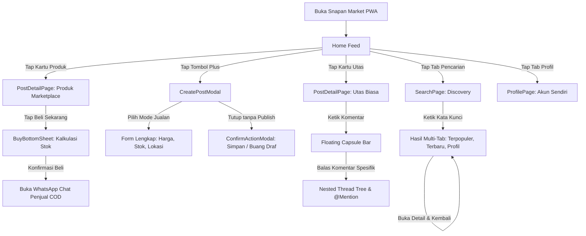

# 📱 DOKUMENTASI SUPER LENGKAP: OVERVIEW, FITUR & ARSITEKTUR INTERAKSI
## SNAPAN MARKET MOBILE PWA — SMKN 8 JAKARTA
> **Spesifikasi Produk, Detail Interaksi Pengguna (User Flows), State Machine, dan Rekayasa Motion Kelas Industri**  
> *Disusun sebagai Panduan Resmi Pengujian Aplikasi, Presentasi Ujian/PJBL, dan Dokumentasi Portofolio Teknis.*

---

## 📌 DAFTAR ISI
1. [Overview Aplikasi, Visi, & Dampak Sosial-Ekonomi Sekolah](#1-overview-aplikasi-visi--dampak-sosial-ekonomi-sekolah)
2. [Matriks Peran Pengguna (User Persona Matrix)](#2-matriks-peran-pengguna-user-persona-matrix)
3. [Arsitektur Navigasi & Peta Alur Pengguna (End-to-End User Journey)](#3-arsitektur-navigasi--peta-alur-pengguna-end-to-end-user-journey)
4. [Bedah Detail Interaksi Komponen & State Machine per Halaman](#4-bedah-detail-interaksi-komponen--state-machine-per-halaman)
   - 4.1. [Halaman Utama & Feed Komunitas (Home Feed)](#41-halaman-utama--feed-komunitas-home-feed)
   - 4.2. [Marketplace & Alur Transaksi COD (Buy Flow)](#42-marketplace--alur-transaksi-cod-buy-flow)
   - 4.3. [Modal Pembuatan Utas & Produk Jualan (Create Post Modal)](#43-modal-pembuatan-utas--produk-jualan-create-post-modal)
   - 4.4. [Mesin Pencarian Multi-Dimensi (Search Engine & Discovery)](#44-mesin-pencarian-multi-dimensi-search-engine--discovery)
   - 4.5. [Detail Postingan & Alur Diskusi Bersarang (Thread & Nested Replies)](#45-detail-postingan--alur-diskusi-bersarang-thread--nested-replies)
   - 4.6. [Profil Siswa, Edit Profil, & Badge Verifikasi Sekolah](#46-profil-siswa-edit-profil--badge-verifikasi-sekolah)
   - 4.7. [Sistem Modal Konfirmasi Terpadu (ConfirmActionModal Engine)](#47-sistem-modal-konfirmasi-terpadu-confirmactionmodal-engine)
5. [Standar Rekayasa Motion, Taktil Haptic, & Performa 120 FPS](#5-standar-rekayasa-motion-taktil-haptic--performa-120-fps)
6. [Arsitektur Teknis, Keamanan Data, & PWA Service Layer](#6-arsitektur-teknis-keamanan-data--pwa-service-layer)

---

## 1. Overview Aplikasi, Visi, & Dampak Sosial-Ekonomi Sekolah

### 💡 Latar Belakang & Visi Produk
**Snapan Market Mobile** adalah platform terintegrasi *2-in-1* yang menggabungkan kekuatan **Marketplace Ekonomi Kreatif** dengan **Media Sosial Forum Utas (*Threads-style Social Network*)** yang dirancang eksklusif dan aman untuk seluruh ekosistem **SMKN 8 Jakarta** ("Snapan").

```
┌─────────────────────────────────────────────────────────────────────────┐
│                    SNAPAN MARKET MOBILE ECOSYSTEM                       │
├────────────────────────────────────┬────────────────────────────────────┤
│     🛍️ EKONOMI KREATIF (MARKET)    │     💬 KOMUNIKASI & UTAS (FORUM)   │
│ • Sirkulasi barang preloved sekolah│ • Diskusi materi pelajaran & PJBL  │
│ • Komersialisasi karya kejuruan    │ • Info magang, ekskul, & tugas     │
│ • Pesan jajanan kantin sekolah     │ • Polling voting keputusan sekolah │
│ • Transaksi COD aman di kelas      │ • Verifikasi identitas siswa resmi │
└────────────────────────────────────┴────────────────────────────────────┘
```

### 🎯 3 Nilai Utama yang Dihadirkan:
1. **Efisiensi Sirkulasi Barang Sekolah**: Mempermudah adik kelas membeli seragam bekas layak pakai, buku paket kejuruan, dan alat praktik (modul Arduino, multimeter, seragam bengkel/lab) dari kakak kelas dengan harga terjangkau.
2. **Komersialisasi Karya & Keahlian Jurusan**: Siswa PPLG (coding/web), DKV (desain logo/stiker), TJKT (servis PC/jaringan), dan Kuliner (snack) dapat langsung memasarkan jasa/produk mereka ke ratusan siswa lainnya tanpa biaya perantara.
3. **Penyatuan Komunikasi Tanpa Batas Waktu**: Menggantikan keterbatasan status WhatsApp Story yang terfragmentasi dan hilang dalam 24 jam dengan feed publik yang terindeks dan bisa dicari kapan saja.

---

## 2. Matriks Peran Pengguna (User Persona Matrix)

| Tipe Pengguna | Skenario Interaksi Utama | Kebutuhan UX Kritis |
| :--- | :--- | :--- |
| **Siswa Penjual (Seller)** | Membuka `CreateModal`, toggle mode jualan, upload 3 foto produk, tentukan harga IDR, lokasi kelas, dan stok. | Form cepat ($< 30$ detik), simpan draf otomatis jika terganggu panggilan/tugas. |
| **Siswa Pembeli (Buyer)** | Scroll feed, melihat label harga, membuka detail barang, cek stok, tap `Beli Sekarang`, dan lanjut COD via WhatsApp. | Informasi harga & stok jelas, tombol aksi mengambang (*Sticky Buy Bar*), respon instan 0ms. |
| **Siswa Kreator & Diskusi** | Menulis utas seputar bug koding / info lomba, melampirkan foto hasil desain, membuat polling voting. | Format teks rapi (*hashtags*, *mentions*), kolom komentar bertingkat yang terstruktur. |
| **Guru & Pembina Sekolah** | Mengawasi ekosistem jual-beli, menyematkan pengumuman resmi, memverifikasi akun siswa dengan Centang Biru. | Lingkungan aman, kemampuan moderasi (hapus/lapor), identitas terverifikasi. |

---

## 3. Arsitektur Navigasi & Peta Alur Pengguna (End-to-End User Journey)



---

## 4. Bedah Detail Interaksi Komponen & State Machine per Halaman

### 4.1. Halaman Utama & Feed Komunitas (Home Feed)

#### Anatomi Kartu Postingan (`MarketPostCard.tsx`)
Setiap kartu di Home Feed memiliki hierarki visual yang sangat rapi:
1. **Header Penulis**: Avatar bulat ($36\text{px}$), nama lengkap tebal, badge kelas (misal: `XII PPLG 1`), penanda waktu relatif (misal: `2 jam yang lalu`), dan tombol titik tiga opsi menu.
2. **Badge Produk (Jika Mode Jualan)**: Pill berwarna amber/hijau yang menampilkan harga `Rp 45.000` dan ketersediaan stok `Sisa 3`.
3. **Badan Konten**: Teks deskripsi dengan *auto-detection* hashtag (`#frontend`, `#kantin`) dan tautan @mention yang dapat diklik.
4. **Media Carousel**: Tampilan foto horizontal dengan indikator titik dot halus untuk postingan multi-gambar.
5. **Bilah 4 Tombol Aksi Bawah**: Love, Komentar, Repost, dan Share.

#### State Machine & Logika Interaksi Aksi:
- **Aksi Love / Suka**:
  - *Pemicu*: Pengguna mengetuk icon Love.
  - *Transisi Visual*: Icon mengalami *Micro-Pop* berskala $0.8 \rightarrow 1.25 \rightarrow 1.0$, warna berubah menjadi `Ruby Red (#e11d48)`, counter likes bertambah $+1$ secara optimis (*Optimistic UI*).
  - *Taktil*: Memicu getaran `haptics.light()`.
  - *Sinkronisasi Data*: Mengirim pembaruan mutasi ke Supabase Database secara *debounced* di latar belakang.
- **Aksi Repost**:
  - *Pemicu*: Pengguna mengetuk icon Repost.
  - *Transisi Visual*: Icon berputar halus $180^\circ$ dengan transisi warna `Emerald Green (#059669)`.
  - *Menu Aksi*: Memunculkan pilihan "Sebar Ulang Utas" atau "Kutip Utas".
- **Aksi Simpan / Bookmark**:
  - *Transisi Visual*: Icon berubah menjadi pita terisi warna `Amber Gold (#d97706)` dan memunculkan toast banner *"Disimpan ke Markah"*.
- **Smart Scroll Navigation Behavior**:
  - Saat pengguna melakukan *scroll down* (> $80\text{px}$): Header atas dan bilah navigasi bawah otomatis meluncur keluar layar (`translateY(-100%)` & `translateY(100%)`) untuk memberikan ruang baca visual $100\%$ tanpa gangguan.
  - Saat pengguna melakukan *scroll up* atau berpindah kembali ke tab Home dari halaman lain: Navigasi **langsung terbuka seketika (*auto-show locked*)**.

---

### 4.2. Marketplace & Alur Transaksi COD (Buy Flow)

Khusus postingan bertipe produk jualan, halaman detail mengaktifkan mode marketplace penuh:

#### 1. Sticky Buy Bar Mengambang
- Terletak melayang di bagian bawah layar detail produk dengan elevasi bayangan `shadow-[0_-8px_30px_rgba(0,0,0,0.12)]`.
- Menampilkan:
  - Label harga tebal: `Rp 45.000`
  - Keterangan stok: `Stok Tersedia: 3 pcs`
  - Tombol aksi utama: `[ Beli Sekarang ]` dengan ikon tas belanja (`ShoppingBag`).

#### 2. Lembar Transaksi Bawah (`BuyBottomSheet.tsx`)
- *Pemicu*: Mengetuk tombol `[ Beli Sekarang ]`.
- *Animasi*: Lembar meluncur mulus dari dasar layar (*Slide Up from bottom*) menggunakan *Framer Motion spring physics*.
- *Komponen Interaktif*:
  - **Selector Kuantitas**: Tombol `[ - ]` dan `[ + ]` dengan validasi otomatis (tidak bisa kurang dari 1 dan tidak bisa melebihi batas stok yang tersedia).
  - **Kalkulasi Total Otomatis**: Subtotal terhitung secara *real-time* berdasarkan jumlah pcs yang dipilih.
  - **Tombol Eksekusi "Beli Sekarang (COD SMKN 8)"**:
    - Mengetuk tombol ini otomatis menyusun template pesan WhatsApp terformat rapi:
      ```
      Halo @penjual, saya ingin membeli [Nama Produk] sebanyak [X] pcs dengan total Rp [Total]. Apakah bisa janjian COD di area kelas [Lokasi]?
      ```
    - Aplikasi langsung mengarahkan ke aplikasi WhatsApp penjual dengan nomor telepon yang terdaftar.

---

### 4.3. Modal Pembuatan Utas & Produk Jualan (Create Post Modal)

Diakses melalui tombol tambah `[ + ]` di navbar tengah:

#### 1. Mode Switcher (Tab Utas vs Jual Barang)
- **Tab Utas (Default)**: Area pengetikan teks luas, avatar pengguna aktif, placeholder *"Apa yang sedang terjadi di Snapan?"*.
- **Tab Jual Barang**: Membuka blok form tambahan:
  - Input Nama Barang (Teks)
  - Input Harga (Format otomatis angka Rupiah dengan prefix `Rp`)
  - Input Stok Barang (Number counter)
  - Selector Lokasi (Pill pilihan cepat: `XII PPLG`, `XI DKV`, `Kantin Utama`, `Bengkel Otomotif`, dll.)

#### 2. Fitur Lampiran Media Lengkap
- **Upload Gambar**: Mendukung pemilihan multi-foto dengan kompresi otomatis di sisi klien sebelum upload ke Supabase Storage. Menampilkan thumbnail preview dengan tombol hapus `[ ✕ ]`.
- **Topic Selector (Titik Tiga Topic)**: Membuka pill daftar topik trending (`#frontend`, `#kantin`, `#preloved`, `#lomba`, `#curhat`).
- **Poll Builder**: Membuka input opsi polling (Pilihan 1, 2, 3) beserta durasi waktu voting.

#### 3. Sistem Pengaman Draf Cerdas (*Draft Engine*)
- Setiap karakter yang diketik otomatis tersinkronisasi ke memori lokal browser (`localStorage['snapan_thread_draft']`).
- Jika pengguna menekan tombol `[ Batal ]` saat ada tulisan yang belum diposting:
  - Muncul dialog **`ConfirmActionModal`**:
    - `[ Simpan ]` $\rightarrow$ Menyimpan draf dan menutup modal. Saat modal dibuka kembali, teks dan foto lama otomatis terisi kembali.
    - `[ Jangan simpan ]` $\rightarrow$ Menghapus draf dari storage dan mereset form menjadi kosong.
    - `[ Batal ]` $\rightarrow$ Menutup dialog konfirmasi dan tetap berada di form pengetikan.

---

### 4.4. Mesin Pencarian Multi-Dimensi (Search Engine & Discovery)

Pusat eksplorasi konten dan pencarian warga sekolah:

#### 1. Input Pencarian & Live Tokenized Scoring
- Search bar berbentuk kapsul dengan fokus cepat dan tombol reset `[ ✕ ]`.
- Menggunakan algoritma pencarian multi-faktor yang memindai:
  - Kesesuaian teks caption
  - Hashtag / topik
  - Judul barang jualan
  - Username dan nama lengkap pembuat postingan

#### 2. Tiga Tab Kategori Hasil Pencarian
- **Tab Terpopuler**: Mengurutkan postingan berdasarkan kombinasi skor relevansi kata kunci dan jumlah interaksi (Likes + Komentar).
- **Tab Terbaru**: Menampilkan hasil pencarian berdasarkan urutan waktu postingan paling baru.
- **Tab Profil**: Menampilkan kartu profil siswa dan toko jurusan yang sesuai dengan kata kunci.

#### 3. Preservasi State Navigasi (*Zero State Loss*)
- Jika pengguna membuka postingan dari hasil pencarian lalu menekan tombol Kembali:
  - Halaman `SearchPage` dipertahankan di memori DOM (`hidden/block`).
  - Kata kunci pencarian, tab yang aktif, dan posisi scroll **100% tidak pernah hilang atau ter-reset**.
- Tombol `[ ← ]` di dalam search bar:
  - Jika sedang di hasil pencarian: Mengosongkan kata kunci dan kembali ke halaman awal *Discovery Topics*.
  - Jika di halaman awal: Kembali ke Home Feed.

---

### 4.5. Detail Postingan & Alur Diskusi Bersarang (Thread & Nested Replies)

#### 1. Pohon Utas Bersambung (*Vertical Threadline*)
- Garis vertikal abu-abu tipis ($2\text{px}$) menghubungkan avatar pembuat postingan utama dengan avatar komentator di bawahnya, menciptakan kesan alur percakapan yang runtut dan natural ala Meta Threads.

#### 2. Floating Comment Capsule Bar
- Dok pengetikan komentar melayang secara konstan di dasar layar dengan padding *Safe Area* HP.
- Mengandung avatar pengguna aktif, textarea elastis yang bertambah tinggi otomatis sesuai panjang kalimat, tombol lampiran gambar, dan tombol `[ Kirim ]` (aktif hanya saat ada teks/gambar).
- Mengetik otomatis menaikkan bilah ini tepat di atas virtual keyboard HP tanpa menutupi daftar komentar.

#### 3. Alur Balas Komentar Spesifik (@Mention Banner)
- Menekan tombol "Balas" pada komentar teman:
  - Memunculkan banner indikator `Membalas @username` di atas input bar.
  - Textarea otomatis memfokuskan kursor dan menambahkan tagar `@username`.
  - Dilengkapi tombol `[ Batal ]` untuk keluar dari mode balasan spesifik.

#### 4. Sub-Thread Detail Focus (`CommentDetailPage.tsx`)
- Mengetuk tombol *"Lihat balasan lainnya"* membuka lembar fokus sub-thread, mengisolasi percakapan antara dua pengguna agar diskusi panjang tidak mengotori alur feed utama.

---

### 4.6. Profil Siswa, Edit Profil, & Badge Verifikasi Sekolah

#### 1. Header Profil Personal
- Menampilkan foto profil HD dengan bingkai halus, nama lengkap, username `@handle`, badge kelas, bio keahlian, tautan Instagram, dan statistik aktivitas (Total Postingan, Balasan, dan Penjualan Sukses).

#### 2. Tiga Tab Konten Profil
- **Tab Postingan**: Seluruh utas dan jualan yang pernah dibuat oleh siswa.
- **Tab Balasan**: Riwayat komentar dan diskusi yang pernah diikuti.
- **Tab Produk Jualan**: Etalase produk preloved & karya yang saat ini aktif dijual oleh siswa.

#### 3. Modal Verifikasi Resmi SMKN 8 (`VerifiedBadgeModal.tsx`)
- Mengetuk icon Centang Biru membuka modal elegan yang menjelaskan status verifikasi resmi:
  - *Identitas*: Terdaftar sebagai siswa/guru aktif SMKN 8 Jakarta.
  - *Keamanan*: Telah tervalidasi NIS/NIP sekolah dan bebas dari riwayat pelanggaran komunitas.

#### 4. Halaman Edit Profil (`EditProfilePage.tsx`)
- Memungkinkan penggantian avatar (upload custom atau pilih dari 6 preset avatar siswa keren), pengubahan nama, bio, dan tag minat kejuruan.
- **Deteksi Perubahan (`hasChanges`)**: Jika pengguna menekan tombol kembali saat data sudah diubah tapi belum ditekan Simpan, muncul `ConfirmActionModal` (*"Buang perubahan?"* $\rightarrow$ Buang [Destructive] / Batal [Cancel]).

---

### 4.7. Sistem Modal Konfirmasi Terpadu (ConfirmActionModal Engine)

Seluruh dialog konfirmasi aksi kritis di dalam aplikasi telah distandarisasi menggunakan modul tunggal `ConfirmActionModal.tsx` bergaya **Meta Threads Light Mode**:

```
┌─────────────────────────────────────────────────────────────┐
│                   CONFIRM ACTION MODAL                      │
│                                                             │
│                      Simpan ke draf?                        │
│        Simpan ke konsep untuk diedit dan diposting          │
│                      di lain waktu.                         │
│                                                             │
├─────────────────────────────────────────────────────────────┤
│                           Simpan                            │
├─────────────────────────────────────────────────────────────┤
│                        Jangan simpan                        │
├─────────────────────────────────────────────────────────────┤
│                            Batal                            │
└─────────────────────────────────────────────────────────────┘
```

#### Spesifikasi Desain Dialog:
- **Card Surface**: Lebar $280\text{px}$, latar putih bersih (`bg-white`), radius membulat `rounded-[20px]`, bayangan dalam `shadow-[0_20px_60px_rgba(0,0,0,0.18)]`.
- **Daftar Tombol Bersusun (*Segmented Action Rows*)**:
  - Setiap baris tombol memiliki tinggi $50\text{px}$ dengan pembatas garis tipis `divide-y divide-neutral-200/80`.
  - Micro-interaction: `hover:bg-neutral-50 active:bg-neutral-100 active:scale-[0.98]`.
- **4 Titik Integrasi Utama di Aplikasi**:
  1. **Simpan / Buang Draf Utas** (`CreatePostModal`) $\rightarrow$ Simpan / Jangan simpan / Batal.
  2. **Konfirmasi Hapus Postingan** (`PostSubmenuDropdown`) $\rightarrow$ Hapus [Destructive] / Batal.
  3. **Konfirmasi Buang Edit Profil** (`EditProfilePage`) $\rightarrow$ Buang [Destructive] / Batal.
  4. **Konfirmasi Keluar Akun** (`SettingsBottomSheet`) $\rightarrow$ Keluar [Destructive] / Batal.

---

## 5. Standar Rekayasa Motion, Taktil Haptic, & Performa 120 FPS

Mengapa interaksi di Snapan Market Mobile terasa sangat responsif dan tidak patah-patah?

```
┌─────────────────────────────────────────────────────────────┐
│                 ENGINEERING MOTION STANDARDS                │
├─────────────────────────────────────────────────────────────┤
│ 1. Composite-Only GPU (Hanya transform: translate3d & scale)│
│ 2. Zero Layout Thrashing (0 kalkulasi reflow pada CPU)      │
│ 3. True Spring Physics (stiffness: 450, damping: 30)        │
│ 4. Instant Snappiness (0ms artificial delay pada navigasi)  │
│ 5. Active Press Scale (active:scale-[0.98] seketika)        │
│ 6. Micro-Haptics Engine (navigator.vibrate 10ms–15ms)       │
└─────────────────────────────────────────────────────────────┘
```

1. **Eliminasi 300ms Click Delay**: Menggunakan `touch-action: manipulation` dan konfigurasi viewport `viewport-fit=cover` untuk respon sentuhan seketika (**0ms latency**).
2. **Instant Press Scale (`active:scale-[0.98]`)**: Memberikan ilusi tombol fisik yang langsung membal saat jari pertama kali menyentuh layar (*Touch Down*).
3. **Motion Restraint**: Tidak ada animasi zoom layar penuh yang memperlambat membaca; navigasi halaman berpindah secara seketika (*Instant Snappy*), sementara motion pegas hanya diberikan pada dialog konfirmasi dan kartu interaktif.

---

## 6. Arsitektur Teknis, Keamanan Data, & PWA Service Layer

```
┌─────────────────────────────────────────────────────────────┐
│                      FRONTEND LAYER                         │
│  React 18 + TypeScript + Vite + Tailwind v4 + Framer Motion │
└──────────────────────────────┬──────────────────────────────┘
                               │
                               ▼
┌─────────────────────────────────────────────────────────────┐
│                   PWA SERVICE WORKER LAYER                  │
│     Workbox Offline Cache • Web App Manifest • Push APIs    │
└──────────────────────────────┬──────────────────────────────┘
                               │
                               ▼
┌─────────────────────────────────────────────────────────────┐
│                   DATABASE & BACKEND LAYER                  │
│       Supabase PostgreSQL (Tables, Auth, Edge Storage)      │
│          Dilindungi Row Level Security (RLS) Policies       │
└─────────────────────────────────────────────────────────────┘
```

### 🛡️ Keamanan Data & Row Level Security (RLS):
- **Isolasi Mutasi**: Siswa hanya memiliki hak untuk mengubah atau menghapus postingan dan komentar yang dibuat oleh akun mereka sendiri (`auth.uid() = user_id`).
- **Enkripsi Sesi**: Autentikasi menggunakan JWT Token aman yang tersimpan di storage terisolasi browser.
- **Strict TypeScript Typing**: Seluruh interface data di `src/types/supabase.ts` memiliki kontrak tipe yang ketat untuk mencegah runtime crash.

---

> **Snapan Market Mobile — Menghubungkan Kreativitas, Transaksi, dan Komunitas Siswa SMKN 8 Jakarta.**
